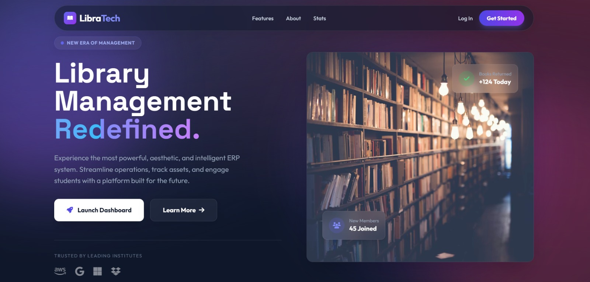

<div align="center">

# 📚 LibraTech - Modern Library Management System


**A Production-Grade, ERP-Style Library Management System with Modern UI/UX**

[Features](#-features) • [Demo](#-demo) • [Installation](#-installation) • [Documentation](#-documentation) • [Screenshots](#-screenshots)

---

</div>

## 🌟 Overview

**LibraTech** is a comprehensive, enterprise-ready Library Management System designed for educational institutions. Built with modern web technologies, it offers a sleek, intuitive interface combined with powerful backend functionality. From book cataloging to student management, from fee collection to advanced analytics - LibraTech handles it all with elegance and efficiency.

### ✨ Why LibraTech?

- 🎨 **Modern UI/UX** - Glassmorphism design with smooth animations
- 🚀 **Production Ready** - Built with best practices and scalability in mind
- 📊 **Data-Driven** - Advanced analytics with dynamic time-range filtering
- 🔒 **Secure** - Role-based access control with encrypted passwords
- 📱 **Responsive** - Works seamlessly on desktop, tablet, and mobile
- 📈 **Professional Reports** - Color-coded Excel exports with comprehensive statistics

---

## 🎯 Features

### 👥 User Management
- **Role-Based Access Control** - Admin, Librarian, and Student roles
- **Profile Management** - Upload profile pictures, update contact information
- **Student Registration** - Public registration with admin approval workflow
- **Bulk Operations** - Import/Export students via Excel

### 📖 Book Management
- **Complete Cataloging** - Title, ISBN, Author, Category, Publisher, Rack Number
- **Cover Images** - Upload and display book covers
- **Stock Tracking** - Real-time availability monitoring
- **Advanced Search** - Filter by title, author, category, ISBN
- **Bulk Import/Export** - Excel-based book catalog management

### 🔄 Circulation System
- **Issue/Return Books** - Streamlined workflow with due date tracking
- **Overdue Management** - Automatic fine calculation
- **Issue Tracking** - Comprehensive view of all issued books
- **Days Issued Counter** - Track how long each book has been borrowed
- **Status Indicators** - Visual badges for active and overdue books

### 💰 Fee Management
- **Fee Headers** - Define multiple fee types (Tuition, Library, Sports, etc.)
- **Fee Application** - Apply fees to students by program/semester
- **Fee Collection** - Record payments with receipt generation
- **Bulk Collection** - Excel-based bulk fee collection
- **Payment Tracking** - Complete payment history with transaction details

### 📊 Analytics & Reports
- **Dynamic Dashboard** - Real-time statistics with interactive charts
- **Time-Range Filtering** - 7 days, 15 days, 30 days, 6 months, 1 year
- **Visual Charts** - Book issues, returns, and activity trends
- **Excel Reports** - Professional, color-coded reports for:
  - 📚 Issued Books (with overdue tracking)
  - 👥 Student Records (with program distribution)
  - 📖 Book Catalog (with availability status)

### 🔔 Smart Features
- **Real-time Notifications** - Book requests, overdue alerts
- **Book Requests** - Students can request books, admins approve
- **Audit Logging** - Track all system activities
- **Search & Filter** - Powerful search across all modules
- **Pagination** - Efficient data loading for large datasets

---

## 🛠️ Tech Stack

### Backend
- **Framework**: Flask 3.0+
- **ORM**: SQLAlchemy
- **Authentication**: Flask-Login
- **Database**: MySQL 8.0+
- **Excel Processing**: openpyxl

### Frontend
- **Template Engine**: Jinja2
- **CSS Framework**: Tailwind CSS (CDN)
- **Icons**: Font Awesome 6
- **Design**: Glassmorphism, Modern UI/UX
- **Animations**: CSS Transitions & Transforms

### Additional Libraries
- **Werkzeug** - Security utilities
- **DateTime** - Date/time handling
- **IO** - File operations

---

## 📦 Installation

### Prerequisites

Before you begin, ensure you have the following installed:
- **Python 3.10+** - [Download Python](https://www.python.org/downloads/)
- **MySQL 8.0+** - [Download MySQL](https://dev.mysql.com/downloads/)
- **Git** (optional) - For cloning the repository

### Step 1: Clone the Repository

```bash
git clone https://github.com/yourusername/libratech.git
cd libratech
```

### Step 2: Create Virtual Environment

```bash
# Windows
python -m venv venv
venv\Scripts\activate

# macOS/Linux
python3 -m venv venv
source venv/bin/activate
```

### Step 3: Install Dependencies

```bash
pip install -r requirements.txt
```

### Step 4: Configure Database

1. Create a MySQL database:
```sql
CREATE DATABASE library_db;
```

2. Update `config.py` with your database credentials:
```python
DB_USER = 'root'
DB_PASS = 'your_password'
DB_HOST = 'localhost'
DB_NAME = 'library_db'
```

### Step 5: Initialize Database

Run the migration script to create tables and seed initial data:

```bash
python migration.py
```

This will:
- Create all necessary tables
- Add default categories and authors
- Create admin and librarian accounts
- Set up initial configuration

### Step 6: Run the Application

```bash
python app.py
```

Visit **http://127.0.0.1:5000** in your browser.

---

## 🔐 Default Credentials

### Admin Account
- **Username**: `admin`
- **Password**: `admin123`
- **Access**: Full system control

### Librarian Account
- **Username**: `librarian`
- **Password**: `lib123`
- **Access**: Book management, issue/return operations

> ⚠️ **Important**: Change these passwords immediately after first login!

---

## 📂 Project Structure

```
libratech/
├── 📄 app.py                      # Main application file
├── 📄 config.py                   # Configuration settings
├── 📄 models.py                   # Database models
├── 📄 migration.py                # Database initialization
├── 📄 requirements.txt            # Python dependencies
├── 📄 README.md                   # This file
│
├── 📁 templates/                  # HTML templates
│   ├── 📁 admin/                  # Admin dashboard templates
│   │   ├── dashboard.html
│   │   ├── student_list.html
│   │   ├── add_student.html
│   │   ├── edit_student.html
│   │   ├── issued_books.html
│   │   └── fees/
│   │
│   ├── 📁 librarian/              # Librarian templates
│   │   ├── book_list.html
│   │   ├── issue_book.html
│   │   └── book_requests.html
│   │
│   ├── 📁 student/                # Student portal templates
│   │   ├── dashboard.html
│   │   └── history.html
│   │
│   ├── 📁 auth/                   # Authentication templates
│   │   ├── login.html
│   │   └── register.html
│   │
│   ├── base.html                  # Base template
│   ├── layout.html                # Dashboard layout
│   ├── landing.html               # Landing page
│   └── profile.html               # User profile
│
└── 📁 static/                     # Static files
    ├── 📁 css/
    │   └── style.css
    └── 📁 uploads/
        ├── books/                 # Book cover images
        └── users/                 # User profile pictures
```

---

## 📸 Screenshots

### Landing Page

Modern, animated landing page with glassmorphism design and smooth scrolling.

### Admin Dashboard

Comprehensive analytics with interactive charts and real-time statistics.

### Book Catalog

Beautiful book catalog with cover images, search, and filtering capabilities.

### Issued Books Tracker

Track all issued books with days issued, due dates, and overdue status.

### Student Management

Manage students with profile pictures, enrollment details, and bulk operations.

### Fee Management

Complete fee management system with collection, receipts, and bulk operations.

---

## 📖 Documentation

### User Roles

#### 🔴 Admin
- Full system access
- User management (add/edit/delete students, librarians)
- Fee management (headers, application, collection)
- Advanced analytics and reports
- System configuration

#### 🟡 Librarian
- Book management (add/edit/delete books)
- Issue/return books
- View book requests
- Generate reports
- Student lookup

#### 🟢 Student
- Browse book catalog
- Request books
- View borrowing history
- Check pending fines
- Update profile

### Key Workflows

#### Issuing a Book
1. Librarian navigates to "Issue Book"
2. Enters student username and book ISBN
3. System validates availability
4. Book is issued with 14-day due date
5. Available copies decremented

#### Returning a Book
1. Librarian finds issued book
2. Clicks "Return" button
3. System calculates fine if overdue (₹5/day)
4. Book marked as returned
5. Available copies incremented

#### Fee Collection
1. Admin creates fee headers (types)
2. Admin applies fees to students
3. Collect fees individually or via bulk Excel
4. Generate receipts
5. Track payment history

---

## 🎨 Design Philosophy

LibraTech follows modern design principles:

- **Glassmorphism** - Frosted glass effect with backdrop blur
- **Color Psychology** - Indigo/Purple for trust, Green for success, Red for alerts
- **Micro-interactions** - Smooth hover effects and transitions
- **Responsive Grid** - Adapts to all screen sizes
- **Dark Theme** - Easy on the eyes with light mode option
- **Consistent Spacing** - 8px grid system throughout

---

## 🚀 Advanced Features

### Excel Reports

All reports include:
- ✅ Professional formatting with color-coded rows
- ✅ Styled headers (purple background, white text)
- ✅ Auto-sized columns for readability
- ✅ Comprehensive summary statistics
- ✅ Timestamp in filename
- ✅ Ready for printing and presentations

### Analytics Dashboard

- **Dynamic Time Ranges** - Switch between 7 days to 1 year
- **Interactive Charts** - Hover for detailed information
- **Real-time Updates** - Data refreshes automatically
- **Visual Indicators** - Color-coded status badges
- **Export Capability** - Download data as Excel

### Photo Module

- **Profile Pictures** - Students and staff can upload avatars
- **Real-time Preview** - See image before uploading
- **Automatic Resizing** - Optimized for web display
- **Fallback Icons** - Default icons when no photo uploaded
- **Secure Storage** - Images stored in dedicated directory

---

## 🔧 Configuration

### Database Configuration (`config.py`)

```python
DB_USER = 'root'           # MySQL username
DB_PASS = 'password'       # MySQL password
DB_HOST = 'localhost'      # MySQL host
DB_NAME = 'library_db'     # Database name
SECRET_KEY = 'your-secret-key'  # Flask secret key
```

### Application Settings

- **Due Date**: 14 days from issue date
- **Fine Rate**: ₹5 per day for overdue books
- **Pagination**: 20 items per page
- **Upload Formats**: PNG, JPG, JPEG, GIF
- **Max File Size**: Configurable in Flask

---

## 🤝 Contributing

Contributions are welcome! Here's how you can help:

1. **Fork the repository**
2. **Create a feature branch** (`git checkout -b feature/AmazingFeature`)
3. **Commit your changes** (`git commit -m 'Add some AmazingFeature'`)
4. **Push to the branch** (`git push origin feature/AmazingFeature`)
5. **Open a Pull Request**

### Development Guidelines

- Follow PEP 8 style guide for Python code
- Use meaningful variable and function names
- Add comments for complex logic
- Test thoroughly before submitting PR
- Update documentation as needed

---

## 🐛 Bug Reports

Found a bug? Please open an issue with:
- Clear description of the problem
- Steps to reproduce
- Expected vs actual behavior
- Screenshots (if applicable)
- System information (OS, Python version, etc.)

---

## 📝 License

This project is licensed under the MIT License - see the [LICENSE](LICENSE) file for details.

---

## 👨‍💻 Author

**Your Name**
- GitHub: [@yourusername](https://github.com/yourusername)
- Email: your.email@example.com

---

## 🙏 Acknowledgments

- **Flask** - Micro web framework
- **SQLAlchemy** - SQL toolkit and ORM
- **Tailwind CSS** - Utility-first CSS framework
- **Font Awesome** - Icon library
- **openpyxl** - Excel file processing

---

## 📞 Support

Need help? Here's how to get support:

- 📧 **Email**: support@libratech.com
- 💬 **Discord**: [Join our community](https://discord.gg/libratech)
- 📖 **Documentation**: [docs.libratech.com](https://docs.libratech.com)
- 🐛 **Issues**: [GitHub Issues](https://github.com/yourusername/libratech/issues)

---

## 🗺️ Roadmap

### Version 2.0 (Planned)
- [ ] Mobile app (React Native)
- [ ] Email notifications
- [ ] SMS alerts for overdue books
- [ ] QR code scanning for books
- [ ] Multi-language support
- [ ] Advanced reporting with PDF export
- [ ] Integration with external library systems
- [ ] API for third-party integrations

### Version 1.5 (In Progress)
- [x] Photo module for students
- [x] Issued books tracker
- [x] Professional Excel reports
- [x] Advanced analytics dashboard
- [ ] Barcode generation for books
- [ ] Digital library cards

---

<div align="center">

### ⭐ Star this repository if you find it helpful!

**Made with ❤️ by the LibraTech Team**

[⬆ Back to Top](#-libratech---modern-library-management-system)

</div>
